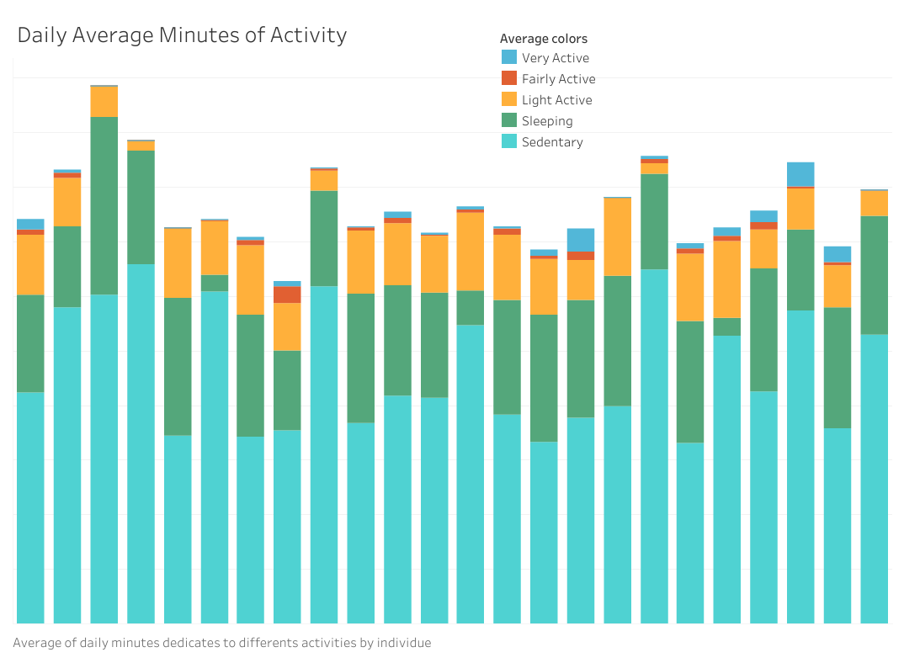
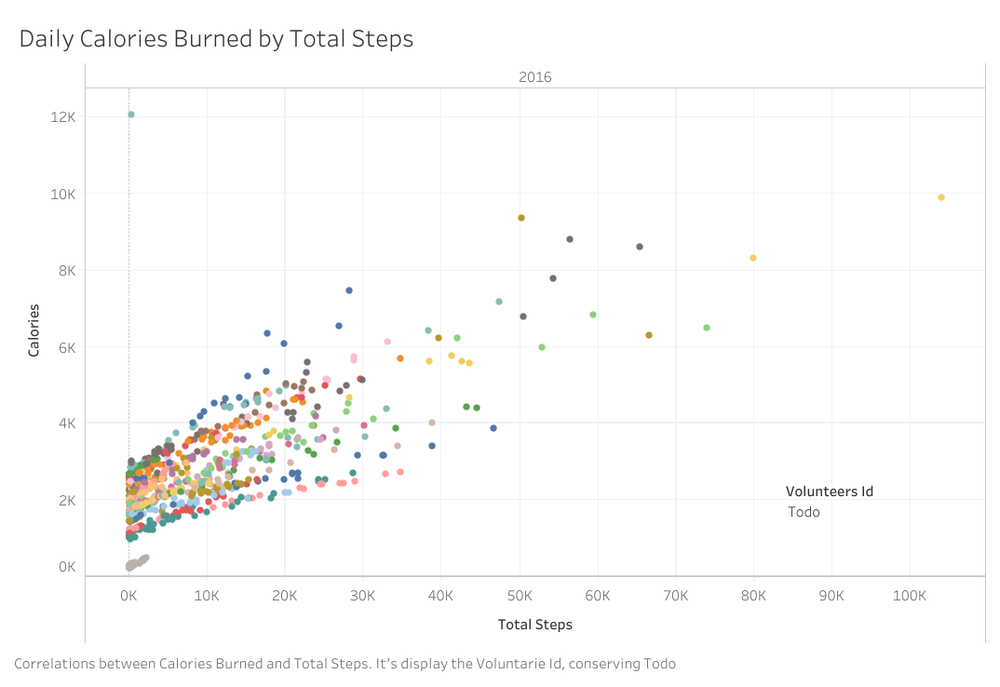
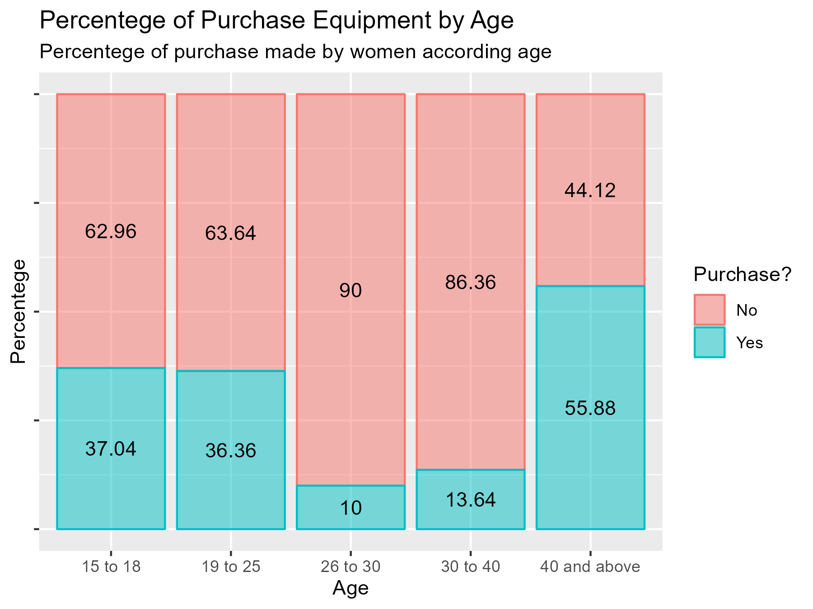
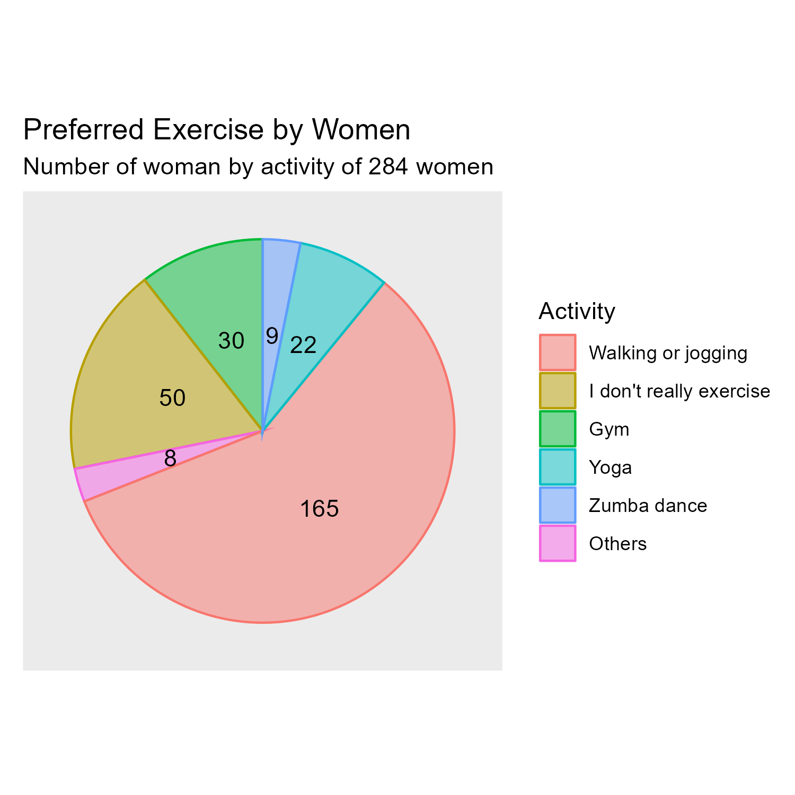

# How a technology wellness company can make smart decisions?
## Asking
### Taks 
_Analyse data on the use of smart devices to know how the customers use other devices different from Bellabeat. After, select a Bellebeat device to apply the new knowledge in the presentation._
### Orientation Questions
1. What are some trends in the use of smart devices?
2. How could these trends apply to Bellabeat customers?
3. How could these trends help in the marketing strategies of Bellebeat?
### Stakeholders
+ Main stakeholder: **Urška Sršen**, Bellabeat’s co-founder and Chief Creative Officer;
+ Stakeholder: **Sando Mur**, Mathematician and Bellabeat’s co-founder
+ Stakeholders: Bellabeat **marketing analytics team**
## Preparing
### Credibility and limitations

**[FitBit Fitness Tracker Data](https://www.kaggle.com/datasets/arashnic/fitbit)** 

The data is in a relational dataset, in CSV formats
- The data has a date from **2016** maybe it could be **outdated**, but we only need the trend of people with smart devices
- Take a sample of **30** random people is a **small** sample
- The data is **just from FitBit** devices
- The data has authorizations by 30 people

**[Fitness Analysis](https://www.kaggle.com/datasets/nithilaa/fitness-analysis)**
  
The data is in a CSV file
- The data has dates from ********2019********
- Take a sample enough big with men and women of different ages
- The data describe the **fitness behavior** of people
- The data is authorized by the people involved and

## Processing
To clean **FitBit Fitness Tracker Data** and  **Fitness Analysis**, It was used _Kate_ and _Excel_, because the first had some problems with the format of the date and hour, so It was changed to a format that Big Query could read, meanwhile, the second dataset was cleaned in _Excel_ 
### Fitness Analysis processing
It was cleaned in a sheet from _Excel_, so we created a control version of the CSV file, and there is documentation about the track changes in the file. To ensure that the information will not be modified the sheet was protected. You can see the document online to see changes and historical versions, [here](https://ugtomx-my.sharepoint.com/:x:/g/personal/e_lopezlozano_ugto_mx/ESSAp7gCM7dAvdaZZN-UsWwB2d_C9CUcEiWnRLY8fqs95A?e=sWHk9B).  _Review > Track Changes_

_R_ was used to transform the data and select the interest data because the data is into one CSV file.

### FitBit Fitness Tracker Data processing
It was cleaned using _Kate_ and _Excel_, because there were some problems with the format of the date and hour, so It was changed to a format that _Big Query_ could read. In the same way, data has a register of historical versions in _Big Query_. _Big Query_ was used to transform the data and select the interest data because it is into some CSV files that can be related to them with SQL.

For the control of versions, we added a clean version of CSV files here in GitHub, in the directory [datasets](datasets).

## Analyzing
You can check all the manipulating processes in the following files:
- [Script_SQL.Rmd](cleaning_scripts/Script_SQL.Rmd).Rmd: describes the filtering processes in _Big Query_
- [Script_R.Rmd](cleaning_scripts/Script_R.Rmd): describes the filtering and creation of graphics in _R_
## Sharing
**FitBit Fitness Tracker Data**

First, we checked that the variable _Id_ was in all the tables from the dataset, and we got a positive result of the query that showed the relationships between tables, so we asked if people spent most of their time doing activities. So we found people spend most of the day sedentary or sleeping on average.

We made a new query to create a new table with the variables of calories burned and total steps by the hour. There is a positive correlation between these two variables which we can see in the visualization Daily Calories Burned by Total Steps. If we watch the visualization closely, we can see that the number of steps is clustered between the origin and the 20 thousand steps daily, which is somehow related to light activity.

 

  

  

**Fitness Analysis**

To complement the results from the analysis of the first dataset, we analyze the Fitness Analysis dataset because there are responses about the fitness life of a person showing their age, gender, and variables useful for our business task. We found that women of 40 years or above usually purchase equipment for fitness activities. On the other hand, we found the principal activity made by women is walking or jogging, which is concordance with the analysis made in the first dataset that shows the persons mainly do light activity.

  

 

  

  

## Acting

Finally, with these patterns, we propose three recommendations:
+ Focusing the efforts on a marketing campaign for women of 40 years or above already because they are the group of women who purchase equipment for fitness activity.
+ Develop a product focusing on walking or jogging for that audience because it's the main activity done by women and is an easy and light activity to be fitness.
+ The product shall be easy to use because our audience won't take the time to learn to use the product.
